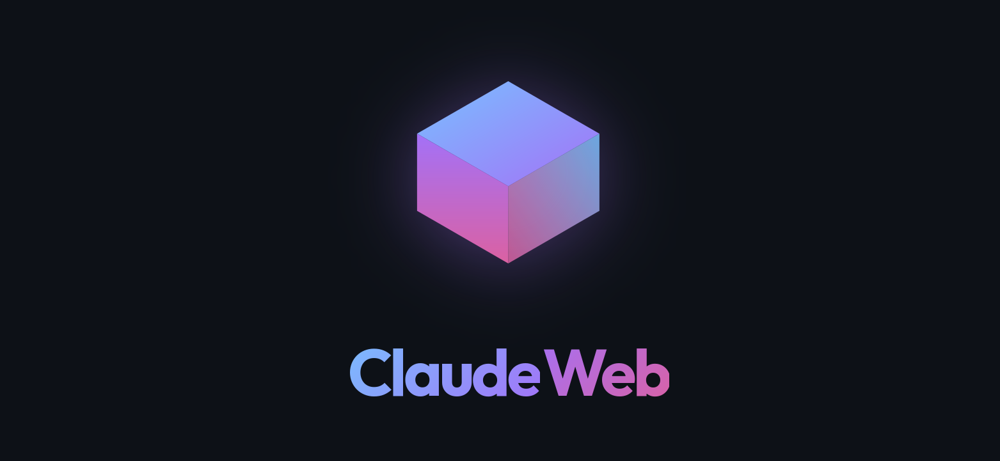
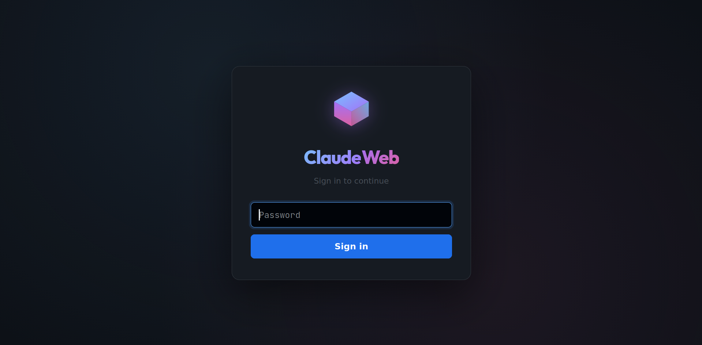
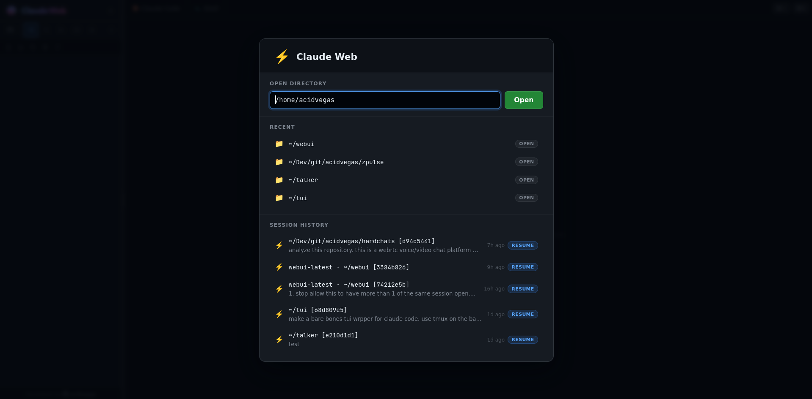
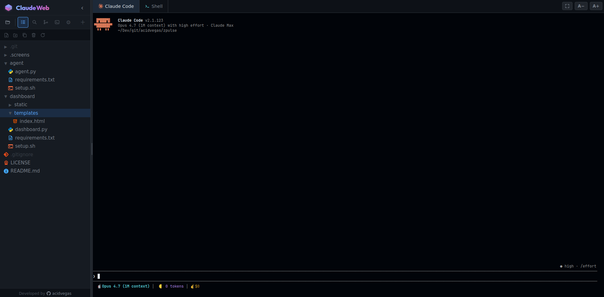
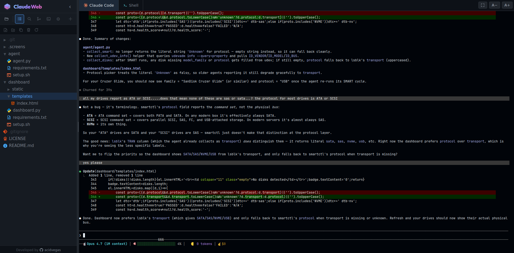
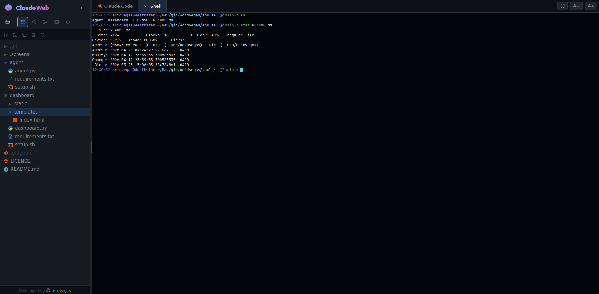
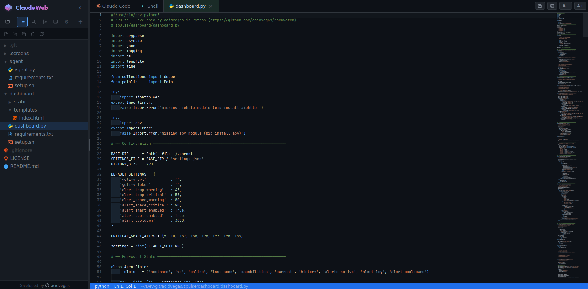
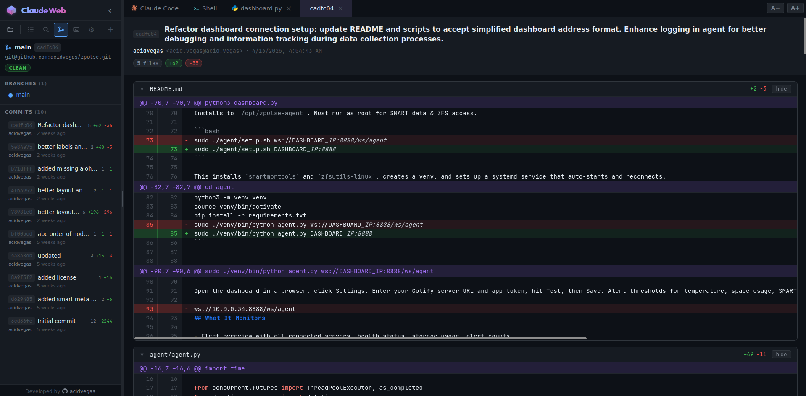

<p align="center">
	
</p>

A self-hosted browser IDE that wraps the [Claude Code](https://claude.com/claude-code) CLI inside a real editor, file explorer, and git viewer, so you don't have to give up the IDE feel just because you want an agent in the loop.

The industry is leaning hard into pure CLI agents, which to me feels impersonal and more of a "trust me bro / vibe code it" experience. For some projects that's fine. For others I still want the intimate overview of my files, directory tree, and manual edits / touch-ups while keeping Claude Code baked in next to me. So I built this.

It's also easy to put behind something like Tailscale and run on a dedicated dev box, so I can pop into a serious dev environment from anywhere without exposing anything publicly.

## Features

- **Claude Code baked in**: every webui session is a real PTY running the `claude` CLI, with full xterm rendering, resize propagation (SIGWINCH), and resumable session history pulled from `~/.claude/projects/<slug>/*.jsonl`.
- **Multi-session**: open as many Claude Code sessions as you want, each in its own working directory. The sessions panel lists everything currently running plus everything historically attached to the current cwd, with delete-from-history support.
- **Monaco editor**: full-featured code editor with rainbow indent guides, GitHub-Dark theme, custom `dotenv` syntax (KEY=value, comments, `${VAR}` interpolation), block caret, gutter markers for unsaved git changes, and click-to-jump search results. Tabs survive switching, with their unsaved buffers intact.
- **File explorer**: full directory tree with drag-and-drop reorganization, ctrl/shift multi-select, new file / new folder / duplicate / delete, hover tooltips with `~/`-prettified paths, [Material Icon Theme](https://github.com/material-extensions/vscode-material-icon-theme) icons, git status badges (M / A / D / ?), and `.gitignore`-aware dimming (works even before `git init`).
- **Code search**: ripgrep-backed in-tree search with include/exclude glob fields, click-to-jump-to-line behavior, syntax-highlighted match preview.
- **Git tab**: current branch, remote URL, ahead/behind tracking, branches list, tags, last 50 commits with `+/-` line counts and file counts. Click any commit to open a diff as its own editor tab: full per-file unified diff with green/red row tints, line numbers, hunk headers, syntax highlighting via highlight.js, collapsible files, hard limits at 25 files / 2000 lines per file with a "+N more hidden for brevity" footer.
- **Built-in terminal tab**: pinned tab running `claude` in the active session's PTY.
- **Password auth**: single-password gate sourced from a project-local `.env`, with a persistent `.webui-secret` so restarts don't log you out.
- **Designed for remote dev**: works great behind Tailscale or any reverse proxy you like.

## Previews








## Setup

Requires **Python 3.10+**, [`claude`](https://docs.claude.com/en/docs/claude-code/setup) on your `PATH`, and [`ripgrep`](https://github.com/BurntSushi/ripgrep) for the search panel.

```bash
git clone https://github.com/acidvegas/claudewebui.git
cd claudewebui

echo "WEBUI_PASSWORD=changeme" > .env

./start.sh
```

`start.sh` will create a `.venv/`, install `flask` and `flask-socketio` from `requirements.txt`, and launch the server on `http://localhost:5000` (override with `PORT=8080 ./start.sh`).

To restart after code changes:

```bash
./restart.sh
```

Behind a reverse proxy, just forward port 5000. Socket.IO works over plain HTTP/HTTPS as long as websocket upgrades are passed through.
